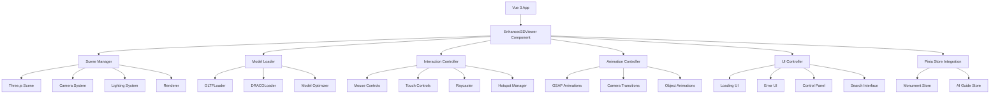

# 设计文档

## 概述

增强的 3D 模型展示系统将为西班牙文化古迹展示平台提供完整的 3D 场景管理、GLB 模型加载、丰富的交互功能和视觉反馈。该系统基于 Three.js 构建，集成 GSAP 动画库，支持 DRACO 压缩的 GLB 模型加载，并与现有的 Vue 3 + Pinia 架构无缝集成。

## 架构

### 整体架构图



### 技术栈

- **核心框架**: Vue 3 + Composition API
- **状态管理**: Pinia
- **3D 渲染**: Three.js r160
- **动画库**: GSAP 3.x
- **模型加载**: GLTFLoader + DRACOLoader
- **构建工具**: Vite
- **样式**: CSS3 + Tailwind CSS

## 组件和接口

### 1. Enhanced3DViewer 主组件

```typescript
interface Enhanced3DViewerProps {
  monumentId: string;
  autoRotate?: boolean;
  enableControls?: boolean;
  showUI?: boolean;
  quality?: "low" | "medium" | "high";
}

interface Enhanced3DViewerEmits {
  "model-loaded": (model: Object3D) => void;
  "hotspot-selected": (hotspot: Hotspot) => void;
  "camera-moved": (position: Vector3, target: Vector3) => void;
  error: (error: Error) => void;
}
```

### 2. SceneManager 场景管理器

```typescript
class SceneManager {
  private scene: THREE.Scene;
  private camera: THREE.PerspectiveCamera;
  private renderer: THREE.WebGLRenderer;
  private lights: THREE.Light[];

  constructor(container: HTMLElement, options: SceneOptions);

  // 场景初始化
  initScene(): void;
  initCamera(): void;
  initRenderer(): void;
  initLights(): void;

  // 渲染循环
  startRenderLoop(): void;
  stopRenderLoop(): void;
  render(): void;

  // 响应式处理
  handleResize(): void;

  // 资源清理
  dispose(): void;
}

interface SceneOptions {
  antialias: boolean;
  shadows: boolean;
  backgroundColor: number;
  cameraFov: number;
  cameraPosition: Vector3;
}
```

### 3. ModelLoader 模型加载器

```typescript
class ModelLoader {
  private gltfLoader: GLTFLoader;
  private dracoLoader: DRACOLoader;
  private loadingManager: LoadingManager;

  constructor();

  // 模型加载
  loadModel(url: string, options: LoadOptions): Promise<GLTF>;

  // 模型优化
  optimizeModel(model: Object3D): Object3D;
  adjustModelScale(model: Object3D, targetSize: number): void;
  centerModel(model: Object3D): void;

  // 进度回调
  onProgress(callback: (progress: number) => void): void;
  onError(callback: (error: Error) => void): void;
}

interface LoadOptions {
  enableDraco: boolean;
  autoScale: boolean;
  autoCenter: boolean;
  targetSize?: number;
}
```

### 4. InteractionController 交互控制器

```typescript
class InteractionController {
  private camera: THREE.Camera;
  private scene: THREE.Scene;
  private raycaster: THREE.Raycaster;
  private mouse: THREE.Vector2;
  private controls: OrbitControls;

  constructor(camera: Camera, scene: Scene, domElement: HTMLElement);

  // 鼠标交互
  setupMouseControls(): void;
  onMouseMove(event: MouseEvent): void;
  onMouseClick(event: MouseEvent): void;
  onMouseWheel(event: WheelEvent): void;

  // 触摸交互
  setupTouchControls(): void;
  onTouchStart(event: TouchEvent): void;
  onTouchMove(event: TouchEvent): void;
  onTouchEnd(event: TouchEvent): void;

  // 射线检测
  performRaycast(mouse: Vector2): Intersection[];
  selectObject(object: Object3D): void;

  // 热点管理
  addHotspot(hotspot: Hotspot): void;
  removeHotspot(id: string): void;
  updateHotspotPositions(): void;
}

interface Hotspot {
  id: string;
  position: Vector3;
  title: Record<string, string>;
  description: Record<string, string>;
  type: "info" | "navigation" | "interaction";
  visible: boolean;
}
```

### 5. AnimationController 动画控制器

```typescript
class AnimationController {
  private gsap: typeof import("gsap");
  private camera: THREE.Camera;
  private activeAnimations: gsap.core.Tween[];

  constructor(camera: Camera);

  // 相机动画
  animateCameraTo(
    position: Vector3,
    target: Vector3,
    duration: number
  ): Promise<void>;
  animateCameraAround(
    center: Vector3,
    radius: number,
    duration: number
  ): Promise<void>;

  // 对象动画
  animateObjectTo(
    object: Object3D,
    position: Vector3,
    rotation: Euler,
    duration: number
  ): Promise<void>;
  animateObjectScale(
    object: Object3D,
    scale: Vector3,
    duration: number
  ): Promise<void>;

  // 场景过渡
  fadeInScene(duration: number): Promise<void>;
  fadeOutScene(duration: number): Promise<void>;

  // 动画控制
  stopAllAnimations(): void;
  pauseAnimations(): void;
  resumeAnimations(): void;
}
```

### 6. UIController UI 控制器

```typescript
class UIController {
  private container: HTMLElement;
  private loadingElement: HTMLElement;
  private errorElement: HTMLElement;
  private controlPanel: HTMLElement;

  constructor(container: HTMLElement);

  // 加载状态
  showLoading(progress: number, message: string): void;
  hideLoading(): void;

  // 错误处理
  showError(error: Error): void;
  hideError(): void;

  // 控制面板
  createControlPanel(): HTMLElement;
  updateControlPanel(state: ViewerState): void;

  // 搜索界面
  createSearchInterface(): HTMLElement;
  showSearchResults(results: SearchResult[]): void;
}

interface ViewerState {
  isLoading: boolean;
  hasError: boolean;
  currentModel: string;
  cameraPosition: Vector3;
  selectedHotspot: string | null;
}

interface SearchResult {
  id: string;
  title: string;
  description: string;
  position: Vector3;
  thumbnail?: string;
}
```

## 数据模型

### 1. Monument 古迹模型

```typescript
interface Monument {
  id: string;
  name: Record<string, string>;
  description: Record<string, string>;
  location: {
    city: string;
    region: string;
    coordinates: { lat: number; lng: number };
  };
  period: string;
  category: string;
  significance: string;
  modelPath: string;
  thumbnail: string;
  interactivePoints: Hotspot[];
  scenes: Scene[];
  searchableAreas: SearchableArea[];
}

interface Scene {
  id: string;
  name: Record<string, string>;
  modelPath: string;
  cameraPosition: Vector3;
  cameraTarget: Vector3;
  hotspots: Hotspot[];
}

interface SearchableArea {
  id: string;
  name: Record<string, string>;
  description: Record<string, string>;
  keywords: string[];
  position: Vector3;
  boundingBox: Box3;
}
```

### 2. ViewerConfiguration 查看器配置

```typescript
interface ViewerConfiguration {
  scene: {
    backgroundColor: number;
    fog: { enabled: boolean; color: number; near: number; far: number };
    shadows: { enabled: boolean; type: "basic" | "pcf" | "pcfsoft" };
  };
  camera: {
    fov: number;
    near: number;
    far: number;
    position: Vector3;
    target: Vector3;
    controls: {
      enableRotate: boolean;
      enableZoom: boolean;
      enablePan: boolean;
      minDistance: number;
      maxDistance: number;
      minPolarAngle: number;
      maxPolarAngle: number;
    };
  };
  lighting: {
    ambient: { color: number; intensity: number };
    directional: {
      color: number;
      intensity: number;
      position: Vector3;
      shadows: boolean;
    };
    point: Array<{
      color: number;
      intensity: number;
      position: Vector3;
      distance: number;
    }>;
  };
  rendering: {
    antialias: boolean;
    pixelRatio: number;
    toneMapping: number;
    toneMappingExposure: number;
  };
  performance: {
    maxFPS: number;
    enableLOD: boolean;
    frustumCulling: boolean;
    occlusionCulling: boolean;
  };
}
```

## 错误处理

### 错误类型定义

```typescript
enum ViewerErrorType {
  MODEL_LOAD_FAILED = "MODEL_LOAD_FAILED",
  WEBGL_NOT_SUPPORTED = "WEBGL_NOT_SUPPORTED",
  INSUFFICIENT_MEMORY = "INSUFFICIENT_MEMORY",
  NETWORK_ERROR = "NETWORK_ERROR",
  INVALID_MODEL_FORMAT = "INVALID_MODEL_FORMAT",
  DRACO_DECODE_ERROR = "DRACO_DECODE_ERROR",
  ANIMATION_ERROR = "ANIMATION_ERROR",
}

class ViewerError extends Error {
  type: ViewerErrorType;
  details: any;
  recoverable: boolean;

  constructor(
    type: ViewerErrorType,
    message: string,
    details?: any,
    recoverable = false
  );
}
```

### 错误处理策略

1. **模型加载失败**: 显示错误信息，提供重试按钮，降级到低质量模型
2. **WebGL 不支持**: 显示兼容性提示，提供 2D 替代方案
3. **内存不足**: 自动降低渲染质量，清理不必要的资源
4. **网络错误**: 实现重试机制，显示网络状态
5. **格式错误**: 提供详细的错误信息，建议替代模型

### 错误恢复机制

```typescript
class ErrorRecoveryManager {
  private maxRetries = 3;
  private retryDelay = 1000;

  async handleError(error: ViewerError): Promise<void> {
    switch (error.type) {
      case ViewerErrorType.MODEL_LOAD_FAILED:
        return this.handleModelLoadError(error);
      case ViewerErrorType.NETWORK_ERROR:
        return this.handleNetworkError(error);
      case ViewerErrorType.INSUFFICIENT_MEMORY:
        return this.handleMemoryError(error);
      default:
        return this.handleGenericError(error);
    }
  }

  private async handleModelLoadError(error: ViewerError): Promise<void> {
    // 尝试加载备用模型或降级版本
  }

  private async handleNetworkError(error: ViewerError): Promise<void> {
    // 实现重试逻辑
  }

  private async handleMemoryError(error: ViewerError): Promise<void> {
    // 清理资源，降低质量
  }
}
```

## 测试策略

### 1. 单元测试

- **SceneManager**: 场景初始化、渲染循环、资源清理
- **ModelLoader**: 模型加载、优化、错误处理
- **InteractionController**: 射线检测、事件处理、热点管理
- **AnimationController**: 动画执行、时间控制、状态管理

### 2. 集成测试

- **组件集成**: Vue 组件与 Three.js 系统的集成
- **状态同步**: Pinia store 与 3D 系统的状态同步
- **事件流**: 用户交互到 UI 更新的完整流程

### 3. 性能测试

- **渲染性能**: FPS 监控、内存使用、GPU 利用率
- **加载性能**: 模型加载时间、网络传输优化
- **交互响应**: 用户操作的响应时间

### 4. 兼容性测试

- **浏览器兼容**: Chrome、Firefox、Safari、Edge
- **设备兼容**: 桌面、平板、手机
- **WebGL 支持**: WebGL 1.0/2.0 兼容性

### 5. 用户体验测试

- **交互流畅性**: 相机控制、对象选择、动画过渡
- **视觉反馈**: 加载状态、错误提示、操作反馈
- **响应式设计**: 不同屏幕尺寸的适配

## 性能优化策略

### 1. 模型优化

- **LOD 系统**: 根据距离自动切换模型细节级别
- **纹理压缩**: 使用 KTX2 格式和 Basis Universal 压缩
- **几何体优化**: 减少顶点数量，合并网格
- **材质优化**: 减少材质数量，使用实例化渲染

### 2. 渲染优化

- **视锥剔除**: 只渲染相机视野内的对象
- **遮挡剔除**: 隐藏被遮挡的对象
- **批处理**: 合并相似的绘制调用
- **延迟渲染**: 对复杂场景使用延迟渲染管线

### 3. 内存管理

- **资源池**: 重用常用的几何体和材质
- **垃圾回收**: 及时清理不再使用的资源
- **纹理管理**: 动态加载和卸载纹理
- **模型缓存**: 缓存已加载的模型数据

### 4. 网络优化

- **模型压缩**: 使用 DRACO 几何体压缩
- **渐进式加载**: 先加载低质量版本，再加载高质量版本
- **CDN 分发**: 使用 CDN 加速模型文件传输
- **预加载**: 预测用户行为，提前加载相关资源

## 安全考虑

### 1. 内容安全

- **模型验证**: 验证 GLB 文件的完整性和安全性
- **资源限制**: 限制模型文件大小和复杂度
- **沙箱执行**: 在安全环境中解析和渲染模型

### 2. 数据保护

- **用户隐私**: 不收集敏感的用户交互数据
- **本地存储**: 安全地存储用户偏好和缓存数据
- **传输加密**: 使用 HTTPS 传输所有资源

### 3. 性能安全

- **资源限制**: 防止恶意模型消耗过多系统资源
- **内存保护**: 防止内存泄漏和溢出
- **CPU 限制**: 限制复杂计算的执行时间

## 国际化支持

### 1. 多语言界面

- **UI 文本**: 支持中文、英文、西班牙文界面
- **错误信息**: 多语言错误提示
- **帮助文档**: 多语言操作指南

### 2. 文化适配

- **交互习惯**: 适配不同文化的交互习惯
- **视觉设计**: 考虑不同文化的视觉偏好
- **内容本地化**: 根据语言调整内容展示

## 可访问性

### 1. 键盘导航

- **焦点管理**: 合理的 Tab 键导航顺序
- **快捷键**: 提供常用操作的快捷键
- **键盘控制**: 支持键盘控制 3D 视角

### 2. 屏幕阅读器

- **ARIA 标签**: 为 3D 元素提供语义化标签
- **替代文本**: 为视觉元素提供文字描述
- **状态通知**: 及时通知状态变化

### 3. 视觉辅助

- **高对比度**: 支持高对比度模式
- **字体缩放**: 支持界面字体缩放
- **色彩无障碍**: 避免仅依赖颜色传达信息

这个设计文档为增强的 3D 模型展示系统提供了完整的技术架构和实现指导，确保系统能够满足所有需求并提供优秀的用户体验。
